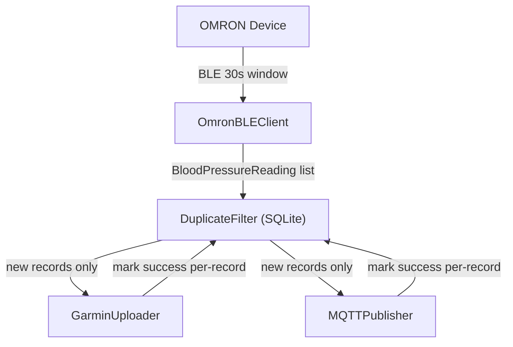

# BLE Sync Workflow

Orchestrate the full OMRON blood pressure device synchronization pipeline:
BLE read → duplicate filter → Garmin upload → MQTT publish.

## Prerequisites Check

Before any sync operation, verify:

1. **Config exists**: `config/config.yaml` must be present and configured
2. **Garmin tokens**: Check `data/tokens/<email>/` for valid OAuth tokens
3. **BLE adapter**: Bluetooth must be available (check `hciconfig` or `bluetoothctl show`)
4. **Device readiness**: OMRON device must be in BT mode (blue LED, 30s window)

## Sync Commands

### One-time sync (full pipeline)

```bash
pdm run python -m src.main sync
```

### Targeted sync

```bash
# Garmin only (skip MQTT)
pdm run python -m src.main sync --garmin-only

# MQTT only (skip Garmin)
pdm run python -m src.main sync --mqtt-only

# Preview without changes
pdm run python -m src.main sync --dry-run
```

### Continuous daemon

```bash
pdm run python -m src.main daemon --interval 60
```

## Device Pairing (first-time setup)

1. Put OMRON device in pairing mode: hold BT button 3+ seconds until "P" blinks
2. Run pairing tool:
   ```bash
   pdm run python tools/pair_device.py --mac 00:5F:BF:91:9B:4B
   ```
3. Device should show square symbol instead of "P" when paired

## Device Scanning

```bash
pdm run python tools/scan_devices.py
```

Looks for devices with "BLESmart", "OMRON", or "HEM-" in name.

## Data Flow



## Multi-User Support

The bridge supports 2 users per OMRON device (slot 1 and slot 2). Configuration maps
each slot to a Garmin account:

```yaml
users:
  - name: "User1"
    omron_slot: 1
    garmin_email: "user1@example.com"
    garmin_enabled: true
    mqtt_enabled: true
```

## Critical Timing

OMRON devices stay in Bluetooth mode for **only ~30 seconds** after pressing the BT button.
All BLE operations must complete within this window. Always instruct the user to press
the BT button immediately before running sync.

## Retry Pending Uploads

Records that failed to upload are tracked in SQLite with per-service flags
(`garmin_uploaded`, `mqtt_published`). Use `tools/sync_records.py` to retry
pending uploads without re-reading from the device.

## Additional Resources

- **`references/ble-protocol.md`** — BLE communication details, EEPROM addresses, CRC validation
