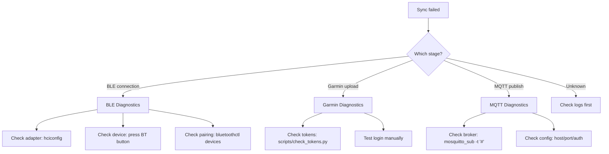

# Troubleshooting Guide

Diagnose and resolve common issues with BLE communication, Garmin uploads,
MQTT publishing, and the sync pipeline.

## Diagnostic Flowchart



## BLE Issues

### "Device not found" / Connection timeout

**Cause:** OMRON device not in BT mode or adapter issue.

**Diagnostic steps:**

1. Check Bluetooth adapter:
   ```bash
   hciconfig
   # Should show hci0 UP RUNNING
   bluetoothctl show
   ```
2. Verify device is discoverable:
   ```bash
   pdm run python tools/scan_devices.py
   ```
3. Check if device is paired:
   ```bash
   bluetoothctl devices
   # Look for OMRON MAC address
   ```

**Fixes:**
- Press BT button on OMRON immediately before sync (30s window)
- If adapter DOWN: `sudo hciconfig hci0 up`
- If device bonded but won't connect: `bluetoothctl remove <MAC>`, then re-pair

### "ATT error 0x0e"

**Cause:** Device timeout — BLE connection dropped during data transfer.

**Fix:** Press BT button again and retry. The 30s window expired.

### "Pairing key does not match"

**Cause:** Device was re-paired with another host, invalidating the stored key.

**Fix:** Re-pair the device:
```bash
bluetoothctl remove <MAC>
pdm run python tools/pair_device.py --mac <MAC>
```

### "Required BLE service not found"

**Cause:** Connected to wrong device (not OMRON) or services not yet discovered.

**Fix:** Specify MAC address explicitly in `config.yaml` → `omron.mac_address`.

## Garmin Issues

### "GarminConnectAuthenticationError"

**Cause:** Expired or corrupted OAuth tokens.

**Diagnostic:**
```bash
pdm run python .claude/skills/garmin-tokens/scripts/check_tokens.py
```

**Fix:** Regenerate tokens:
```bash
pdm run python tools/import_tokens.py --email <email>
```

### "FileNotFoundError: Token directory not found"

**Cause:** Tokens never generated for this email.

**Fix:** See token path in error message. Run `import_tokens.py` for the specific email.

### Duplicate readings in Garmin

**Cause:** Timestamp comparison tolerance (1 minute) too tight or too loose.

**Diagnostic:** Check `garmin_uploader.py:is_duplicate_in_garmin()` — compares within 60s
window with matching systolic + diastolic + pulse.

## MQTT Issues

### "MQTT not connected, skipping publish"

**Cause:** Broker unreachable or authentication failed.

**Diagnostic:**
```bash
# Test broker connectivity
mosquitto_pub -h <host> -p <port> -t test -m "ping"

# With auth
mosquitto_pub -h <host> -p <port> -u <user> -P <pass> -t test -m "ping"

# Subscribe to check if anything arrives
mosquitto_sub -h <host> -p <port> -t "omron/#" -v
```

**Check config:**
```yaml
mqtt:
  host: "192.168.40.19"
  port: 1883
  username: null  # or actual username
  password: null  # or actual password
  base_topic: "omron/blood_pressure"
```

### MQTT connection drops after network change

**Current limitation:** No auto-reconnect implemented. Restart the daemon/container.

## Log Analysis

### Log locations

- **Local:** `logs/omron-bridge.log` (if `logging.file` configured)
- **Docker:** `docker logs omron-garmin-bridge`
- **Streamlit:** stdout (visible in Docker logs)

### Enable debug logging

```bash
# CLI
pdm run python -m src.main sync --debug

# Config
# In config.yaml:
logging:
  level: DEBUG
```

### Key log patterns to search for

| Pattern | Meaning |
|---------|---------|
| `BLE connection established` | Connection OK |
| `Read N records from device` | Device read OK |
| `Filtered N records: X new` | Dedup OK |
| `Uploaded to Garmin` | Garmin OK |
| `Published to` | MQTT OK |
| `ATT error` | BLE timeout |
| `authentication failed` | Garmin token issue |
| `Failed to connect to MQTT` | Broker unreachable |

## Additional Resources

- **`references/error-codes.md`** — Complete error code reference with causes and fixes
